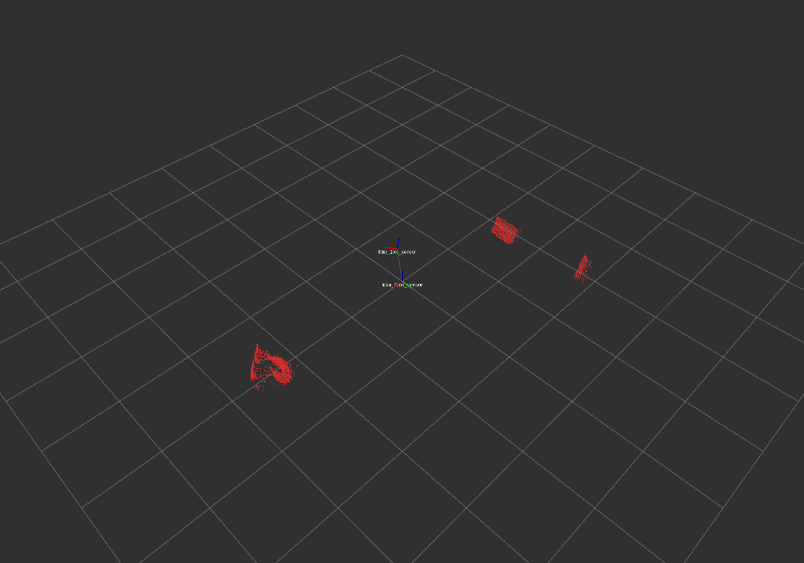
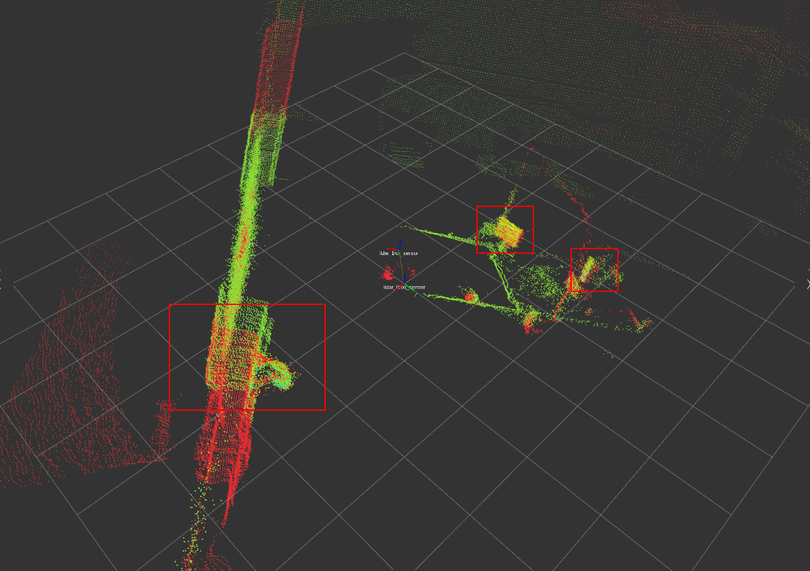
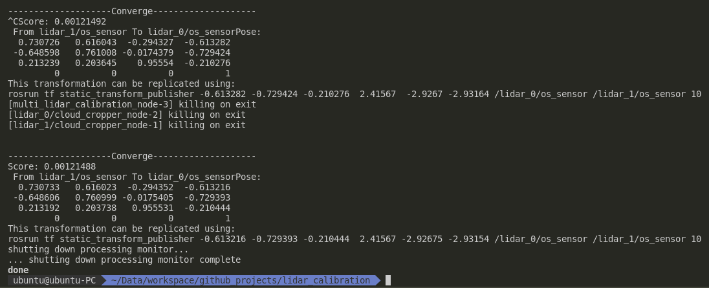

# Multi Lidar Calibration

## Usage

### Step 1. segment significant parts of cloud

The original point cloud should be first segmented in order to eliminate the influences of unimportant  features.

1. modify `crop.launch` file

```xml
<?xml version="1.0"?>
<launch>
    <group ns="lidar_0">
        <param name="mode" value="single"/>
        <param name="input_topic" value="/lidar_0/lidar_node/pointcloud"/> <!-- TODO -->
        <param name="output_topic" value="/lidar_0/pointcloud_filtered"/> <!-- TODO -->

        <node pkg="multi_lidar_calibration" type="cloud_cropper_node" name="cloud_cropper_node" output="screen"/>
        <node pkg="multi_lidar_calibration" type="cloud_crop_helper.py" name="cloud_crop_help" output="screen"/>
    </group>
</launch>
```

2. `roslaunch multi_lidar_calibration crop.launch` to find significant features.


3. write down the segment parameters in the configuration file.

```yaml
input_topic: "/lidar_0/lidar_node/pointcloud"

output_topic: "/lidar_0/pointcloud_filtered"

boxes:
  box0:
    x: -2.69
    y: -0.50
    z: -0.81
    a: 0.19
    b: 0.86
    c: 0.55

  box1:
    x: -2.89
    y: 1.33
    z: -0.82
    a: 0.28
    b: 0.27
    c: 1.40

  box3:
    x: 2.35
    y: 0.18
    z: 0.56
    a: 0.52
    b: 0.56
    c: 0.37
```



### Step 2. Run calibration algorithm

```xml
<?xml version="1.0"?>
<launch>
  <param name="use_sim_time" value="true"/>


  <!-- 1 - 0 -->
  <group ns="lidar_1">
      <param name="config" value="$(find multi_lidar_calibration)/config/crop/lidar_1.yaml"/> <!-- TODO -->
      <param name="mode" value="multi"/>

      <node pkg="multi_lidar_calibration" type="cloud_cropper_node" name="cloud_cropper_node" output="screen"/>
  </group>

  <group ns="lidar_0">
      <param name="config" value="$(find multi_lidar_calibration)/config/crop/lidar_0.yaml"/> <!-- TODO -->
      <param name="mode" value="multi"/>
      
      <node pkg="multi_lidar_calibration" type="cloud_cropper_node" name="cloud_cropper_node" output="screen"/>
  </group>


  <node pkg="multi_lidar_calibration" type="multi_lidar_calibration_node" name="multi_lidar_calibration_node" output="screen">
    <param name="parent_cloud_name" value="/lidar_0/pointcloud_filtered"/> <!-- TODO -->
    <param name="child_cloud_name" value="/lidar_1/pointcloud_filtered"/> <!-- TODO -->
    <param name="voxel_size" value="-1"/>

    <param name="method" value="ICP"/>
    <param name="config_file" value="/home/ubuntu/Data/workspace/github_projects/lidar_calibration/src/multi_lidar_calibration/config/icp.yaml"/>
  </node>
</launch>
```

1. `roslaunch multi_lidar_calibration calibration.launch` to start

The registration process is actually based on these point cloud:


And this is the whole point cloud:


### Result

